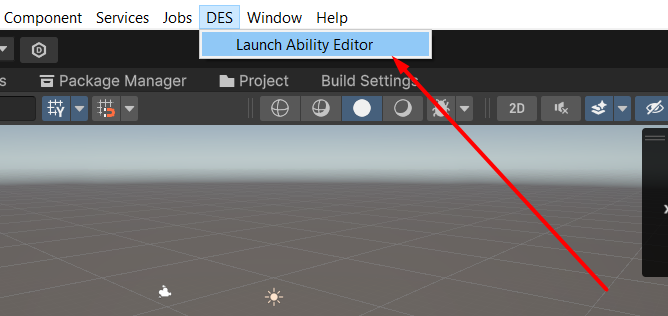
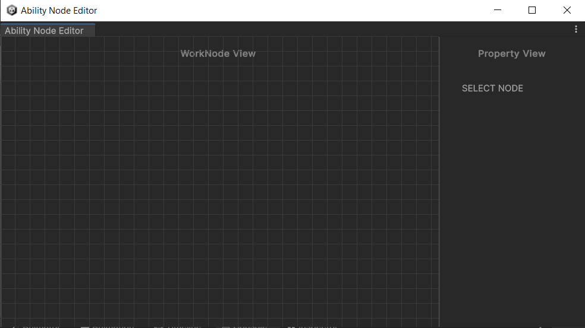
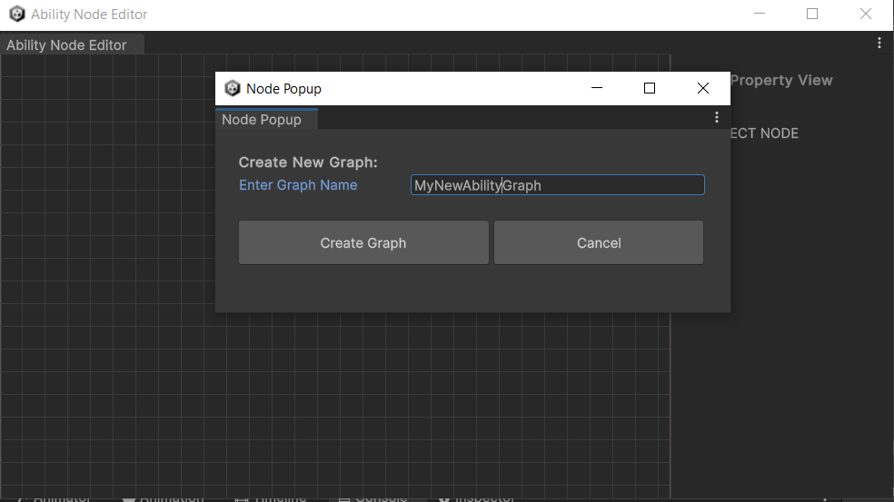
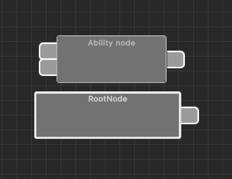
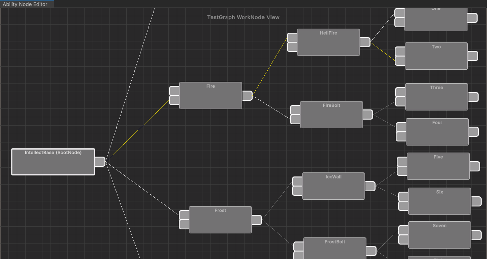
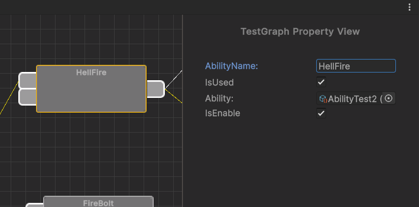
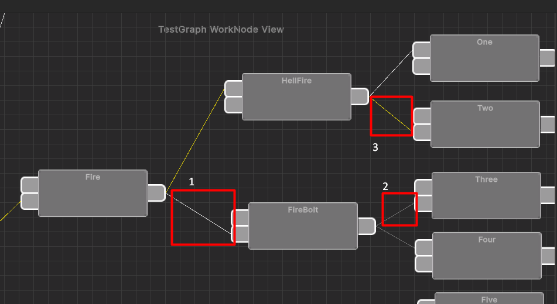

# AbilityNode


[](LICENSE)

> Fast and lightweight editor-based addition

## Description

Node representation of the character ability tree in an RPG game.

## Installation

1. Clone this repository or download the archive and extract it. (Or you can download .unitypackage in the "Release" section)
2. Move the contents of `Assets` to the root folder of your Unity project.

## Usage

1. You can call the editor window through the top context window.




2. To create a new graph, you need to right-click on the field and click "Create New Graph".



3. There are 2 types of nodes in the editor: a root node and an ability node. An ability node is a container for storing the ability itself (inherited from BaseAbility). The root node can also contain useful information and be used as a container for the ability.
   The ability node has one output and 2 inputs for making a more complex system of character skills. The root node has only output.

   
   

4. Nodes can be configured in the "Properties View" window.

   

5. Nodes have 3 types of communication:
   - Open communication (Enable). (1 on the pic)
   - Closed communication. (2 on the pic)
   - Used (3 on the pic)
     

## Example

Example of work from the code:

```csharp
    [SerializeField] private AbilityNodeGraph nodeGraph;
    void Start()
    {
        //Get root node
        BaseNode rootNode = nodeGraph.GetRootAbility();

        //Get ability from node
        BaseAbility rootability = rootNode.Ability;

        //Get all abilities that are marked as IsUsed in graph
        IEnumerable<BaseAbility> accessAbility = nodeGraph.GetAbilities();

        //Get all connections to BaseNodes that are connected to the root node
        var connectins = rootNode.GetNodeOutput().GetConnectedNodes();
    }
```
